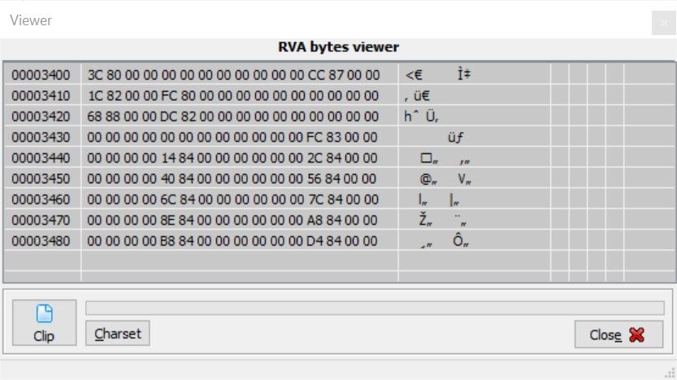
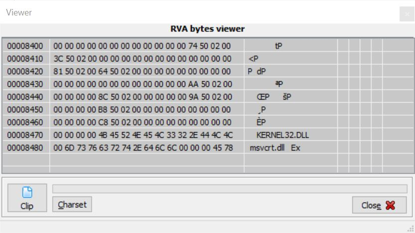
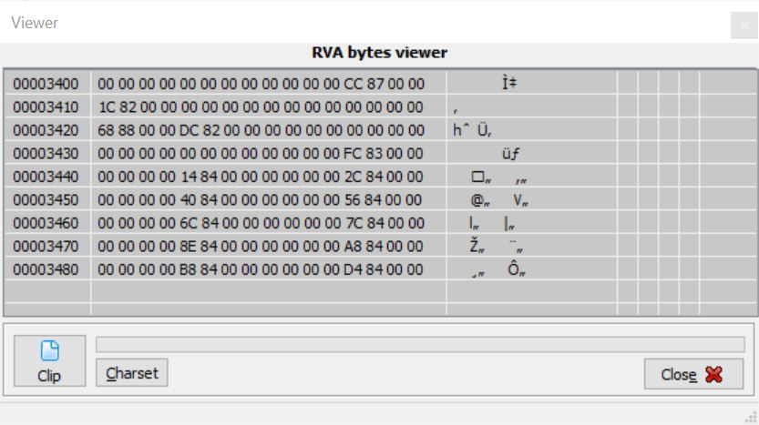

# SecurityHW
In this assignment, we will demonstrate different ways of concealing malware to fool malware detection software.
PE-Import.exe is the original file we will be altering in various ways.

## PE-Import.exe
The function of this file is to determine whether there is a PE-1.txt file containing the string "I want to learn PE file format!". If there is a file, then the executable will simply return that string contained in the file. However, if the file does not already exist, the executable will create that file.

## Packing
Packing/Unpacking is the practice of compressing/decompressing a file. By doing this to a file, the computer will regard the uncompressed and compressed files as distinct files despite the fact that they are the same program.

Below is the image of the original Import Table of PE-Import.exe:

By packing the file using UPX, the file transforms from 130 KB to 67 KB and the Import Table changes:

Unpacking the packed file results in an Import Table that is similar, but still different than the original file, so now the computer assumes there are three different files that have been generated:

